# Letwarnup

## Kiểm tra file

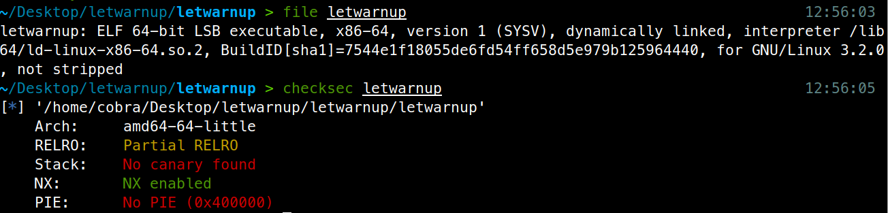

## Reverse it

Chương trình chỉ có 2 hàm duy nhất là `main` và `vuln`

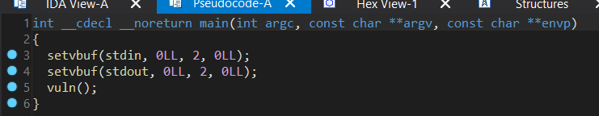

Hàm `main` gọi `setvbuf` và gọi đến hàm `vuln`

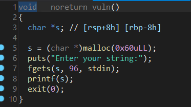

Hàm `vuln` khá đơn giản, đầu tiên hàm tiến hành gọi `malloc` tạo mảng độ lớn 0x60, sau đó gọi lệnh `fgets` và `printf`. Ta có thể dễ dàng thấy được là hàm `printf` gây ra lỗi format string (fmt).

## Phân tích
Vấn đề là ngay sau lỗi format string, chương trình tiến hành gọi `exit(0)`, tức thoát chương trình ngay lập tức. Điều đầu tiên chúng ta nghĩ ngay đến là cần phải thay hàm exit bằng một hàm khác để ngăn chương trình thoát, hoặc là cuộc tấn công của ta phải hoàn thành ngay trước khi chương trình gọi `exit`.

Mình chưa nghĩ ra cách nào khác để tấn công thành công ngay lập tức trước hàm `exit` (mình nghĩ là có cách nhưng do mình chưa biết). Đối với tấn công từ lỗi format string thường sẽ có 2 bước, bước 1 là phải tiến hành leak được địa chỉ libc. Sau khi có được địa chỉ libc thì ta có rất nhiều cách khác, ví dụ: overwrite GOT, overwrite freehook, malloc hook, ...

Ở đây vì RELRO của chúng ta là Partial, vì thế chúng ta có thể tiến hành đè lên GOT table, chúng ta có thể thay GOT entry của `exit` thành địa chỉ hàm `main` hoặc `vuln`, chúng ta sẽ có 1 vòng lặp vô hạn để tiến hành tấn công format string (mỗi lần chương trình gọi exit sẽ gọi `main` hoặc `vuln`).

Ok, hướng đi trong có vẻ đơn giản, chúng ta cần ghi đè GOT entry của `exit` thành địa chỉ của hàm `main` để tạo một vòng lặp vô hạn, sau đó ta tiến hành leak libc address. Sau khi có được libc address, ta có thể tấn công one_gadget hoặc là dùng hàm `system`. Mình sẽ đề cập ở phía sau.

Nhưng một vấn đề có thể các bạn sẽ nhận ra ngay đó là, mảng của chúng ta nằm trên HEAP!!! Điều đó đồng nghĩa việc ghi đè không còn đơn giản như khi mảng nằm trên stack. Chúng ta không thể đơn giản đặt địa chỉ của `exit` GOT vào mảng và tính toán offset như các bài fmt cơ bản.

## Overwrite with format string in heap

Vậy làm sao chúng ta có thể làm điều đó? Thật sự solution khá dễ dàng có thể nghĩ ra được. Nếu bạn chưa thể nghĩ ra trong lúc giải, có thể là bạn đang quá rập khuôn các bước tấn công format string. TẤT CẢ CON TRỎ CÓ TRÊN STACK ĐỀU CÓ THỂ SỬ DỤNG. Đúng vậy, nếu như tình cờ trên stack có 1 con trỏ trỏ thẳng đến return address, đừng dại dột kiếm cách khác để tấn công (này mình ví dụ chơi thôi chứ sao có được 😊). Ở bài này, ta sẽ sử dụng một cách gọi là two-stage-write.

## Two-stage-write

Dùng lệnh readelf để tìm địa chỉ của exit GOT, ta tìm được địa chỉ là 0x404040

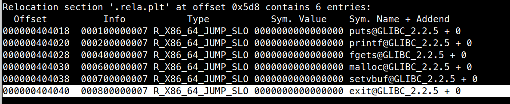

Chặn breakpoint ngay trước câu lệnh `printf`, ta thử kiểm tra stack

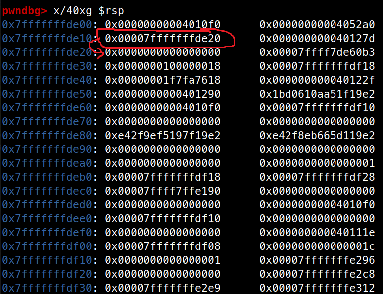

Có vẻ không có một địa chỉ nào chỉ trực tiếp đến 0x404040 để giúp t ghi đè, tuy nhiên, các bạn có thể tìm thấy một địa chỉ luôn luôn xuất hiện mình đã khoanh tròn. Đây chính là save_rbp của hàm vuln, và nó trỏ đến rbp của hàm main.

Cấu trúc của chương trình khi hàm `main()` gọi đến hàm `vuln()` sẽ có dạng như sau:

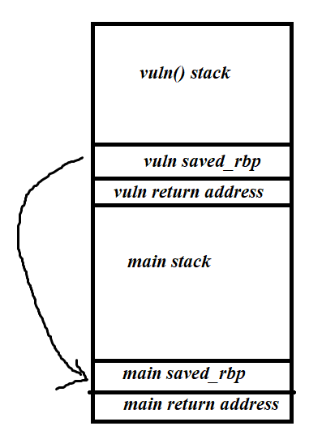

trong đó vuln saved_rbp sẽ trỏ đến main saved_rbp. Chúng ta có thể lợi dụng con trỏ vuln saved_rbp để ghi đè lên main saved_rbp địa chỉ của exit GOT, sau đó dùng con trỏ main saved_rbp để ghi đè địa chỉ tại bảng GOT table, cả 2 bước đều có thể tiến hành trong cùng 1 lần tấn công, đây gọi là two-stage-write (ghi đè 2 bước).

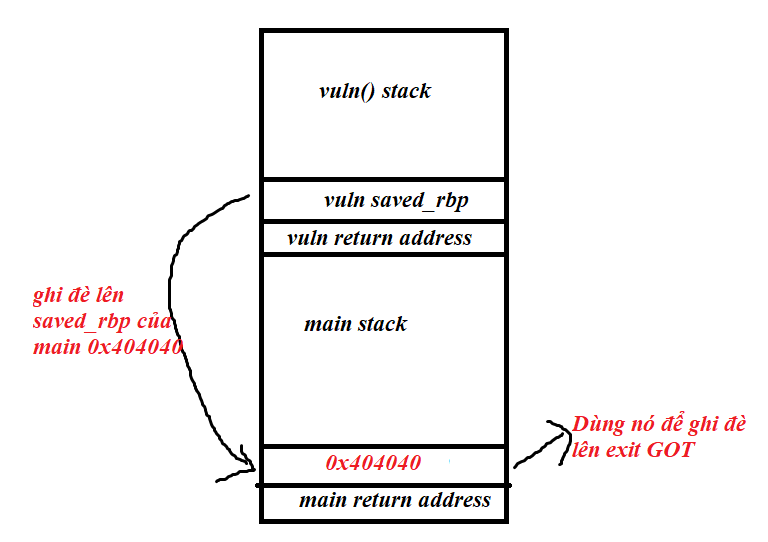

Dùng gdb tìm địa chỉ của hàm main (0x40122f)

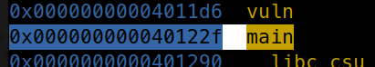

Giá trị hiện tại của exit got là 0x401080, như vậy chúng ta cần ghi đè 2 byte cuối

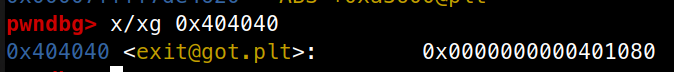

Nếu bạn thắc mắc tại sao exit lại mang địa chỉ này mà không phải là một địa chỉ thuộc libc (0x7f....), mình có thể giải thích là do cơ chế lazy loading của dlresolve, địa chỉ thực của hàm `exit` trong libc chỉ được load lên sau khi hàm được chạy lần đầu tiên, còn trước đó giá trị nằm trong exit got là exit@plt + 4, bạn có thể tự tìm hiểu thêm về cơ chế hoạt động của nó.

Như vậy ta tìm được payload là

`%c%c%c%c%c%c%4210746c%lln%53743c%hn`

Phần 1 `%c%c%c%c%c%c%4210746c%lln` sử dụng vuln saved_rbp để ghi đè lên main saved_rbp giá trị 0x404040. Phần sau `%53743c%hn` sử dụng địa chỉ vừa ghi vào để overwrite 2 byte cuối của exit got thành địa chỉ hàm `main`.

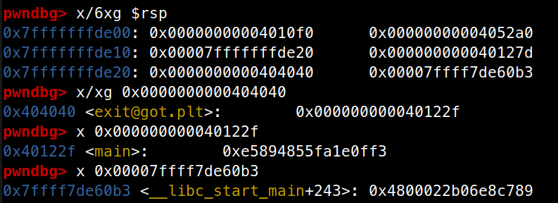

Như vậy là ta đã có một vòng lặp vô hạn, tiếp theo ta tiến hành các bước tấn công thông thường, đầu tiên là dùng format string để leak libc. Mình chọn leak ở return address của hàm main, nó có giá trị là `__libc_start_main + 243`.

Sau khi có libc address, chúng ta tấn công tiếp theo rất đơn giản. Có 2 cách thông dụng mà các pwner thường nghĩ tới, một là chúng ta overwrite exit thành một địa chỉ thuộc one_gadget, hoặc là ta thay địa chỉ ở bảng got table của `printf()` thành `system()`. Sau đó t nhập giá trị chuỗi là `/bin/sh`, khi đó mỗi khi chương trình gọi `printf(buf)`, thực chất là đang gọi `system(“/bin/sh”)`, ta sẽ lấy được shell.

Ở đây mình chọn cách là overwrite printf -> system, cách còn lại thì đơn giản hơn các bạn có thể tìm hiểu thêm.

## Overwrite printf() -> system() and get shell

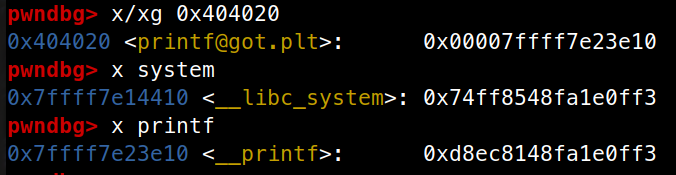

Ta có thể thấy là địa chỉ của `printf` và `system` khác nhau ở 3 byte cuối, thực ra byte cuối cùng bằng nhau (0x10), tuy nhiên solution này của mình đổi cả 3 byte cuối để giúp các bạn sau này gặp lại dạng này có thể hình dung dễ hơn.

Mình sẽ chia làm 2 lần ghi: lần 1 ghi đè 2 byte cuối, lần 2 ghi đè byte còn lại.

Vì chúng ta đã tạo được một vòng lặp vô hạn, chúng ta có thể tạo bao nhiêu địa chỉ tùy ý

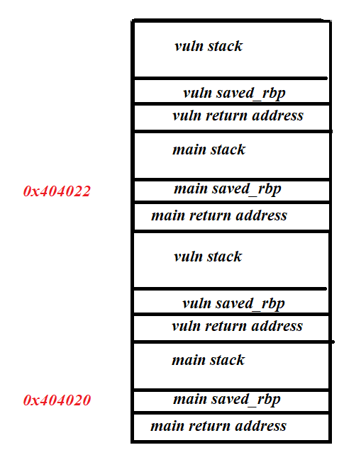

Mình dùng 2 lần lặp để tạo ra 2 địa chỉ tay printf got và printf got + 2, sau đó dùng 2 địa chỉ này để ghi đè printf -> system sử dụng payload sau.

`'%c%c%c%c%c%c%c%c%c%c%c%c%c%c%' + str(target1 - 14) + 'c%hhn%c%c%c%c%' + str(target2 - target1 - 4) + 'c%hn'`

Với target1 là byte thứ 3 và target 2 là 2 byte cuối.

Full solution: [letwarnup.py](src/solution/letwarnup.py)

## Tổng kết:

  - Với format string attack, tất cả các con trỏ trên stack đều có thể sử dụng được

  - Với heap format string, ta vẫn có thể ghi đè vị trí bất kì sử dụng saved_rbp nếu lỗi xảy ra không thuộc hàm main

  - Nếu không thể sử dụng toán tử vị trí (ví dụ %8$n) thử thay thế nó bằng cách thủ công, gọi %c đủ số lần.

Đây là một bài format string nâng cao hơn một chút so với các bài cơ bản thôi, nhưng không khó. Khi ra bài này mình đánh giá là ở mức dễ vì thời gian là 24 tiếng. Tuy nhiên mình hơi thất vọng vì hơi ít người giải ra được. Hy vọng các bạn thấy hay và học được gì đó. Cảm ơn đã tham gia.

