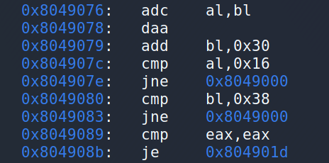
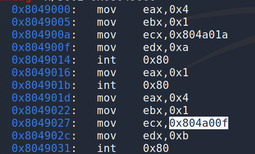
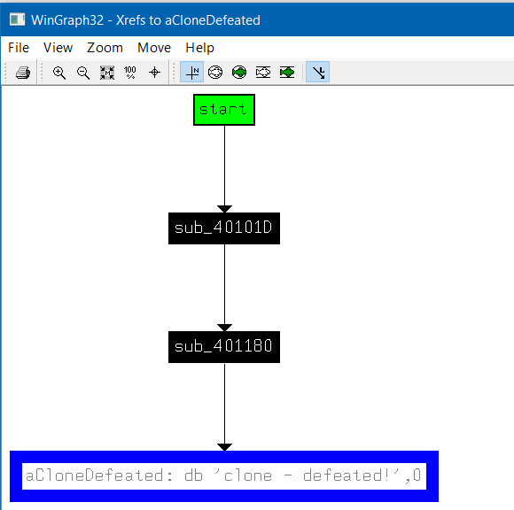

# Write up RE challenge Release_1

## Linux

### crack_nasm
Chương trình yêu cầu nhập Flag

Sử dụng GDB để xem mã x86 của hàm main

Ta nhận thấy ở đây nếu phép so sánh trả là đúng thì hàm success sẽ chạy vì vậy ta đặt breakpoint tại 0x08048100 và chạy thử.

Kiểm tra giá trị của ebx, ecx

Chuỗi “aaa” là chuỗi nhập vào từ bàn phím và chuỗi cần so sánh là "S3CrE+Fl4G!". Vậy chỉ cần nhập vào "S3CrE+Fl4G!" là thành công

### Es crack
Đây là file có đuôi exe tuy nhiên khi kiểm tra thì nó chạy trên linux

Chạy thử và chương trình yêu cầu nhập một chuỗi

Chuỗi trong bài nào khá dễ tìm, chỉ cần dùng lệnh strings

Nhập chuỗi “P455w0rdYou Got This!” vào chạy thử và thành công

### hello
Chạy thử chương trình, chương trình yêu cầu nhập username và password

Dùng GDB để xem x86

Chương trình yêu cầu nhập vào username và lưu vào địa chỉ 0x402074, sau đó tiếp tục lưu vào địa chỉ 0x40209a

Chuỗi password được lưu ở 0x402074, sau đó là một vòng lặp so sánh các kí tự trong chuỗi username và password, nếu username + 5 != pasword thì nhảy vào vùng <_start.wrong>, lặp như vậy đến hết chuỗi. Vì không yêu cầu độ dài nên ta thử nhập user = ‘A’ và password = ‘F’ (‘F’ = ‘A’ + 5).

Như vậy là ta đã thành công.

### Lucky
Chạy thử file

Kiểm tra file, đây là một file đã bị strip

Dùng GDB mở file, ta không tìm thấy functions nào cả vì file đã bị strip

Vì vậy ta dùng objdump để xác định phần text section của chương trình

Ta nhận thấy .text bắt đầu từ 0804900

Mở lại GDB, dùng x/i để xem lệnh

Mở đầu .text section chưa chắc là hàm _start, nhưng ta biết khi mới chạy chương trình sẽ xuất ra dòng “Lucky Numbers:” Vì vậy ta kiểm tra các vị trí xuất ra màn hình có chuỗi “Lucky Numbers:”

Kiểm tra phần text phía trên

Ta nhận thấy phía trên chỗ code xuất chuỗi ra là syscall exit, vì vậy ta đoán khả năng cao đây là nơi bắt đầu của hàm _start.

Sau khi xuất ra chuỗi “Lucky…” thì chương trình yêu cầu nhập vào chuỗi có 2 kí tự, cả 2 kí tự đều được đem – 48 và so sánh, al + bl = 0x16 và bl + 0x30 = 0x38.

Kiểm tra code ở địa chỉ 0x804901d và 0x8049000

Cả 2 đều xuất ra chuỗi và exit, tuy nhiên 0x804901d xuất ra “Good Job”

Vì vậy ta cần nhảy đến 0x804901d thì al = 0x8 và bl=0x8, tìm được 2 kí tự cần tìm là “88”

### nasm
Chạy thử chương trình

Chương trình yêu cầu nhập password, mở chương trình trong GDB

Ta nhận thấy nếu 2 chuỗi 0x402026 và 0x402031 bằng nhau thì hàm correct_func được gọi, và 0x402031 là địa chỉ chuỗi chúng ta nhập vào. Kiểm tra chuỗi còn lại

Nhập “supersecret” vào chương trình và thành công

## Window

### Clone
Chạy thử chương trình

Dùng IDA để phân tích.
Sơ đồ của chương trình

Mở cửa sổ string lên ta nhận thấy có chuỗi “Well done! Now make good tutorial :)”, “clone - defeated!”, “Bravo!”. Tất cả chuỗi này đều có chung một hướng đi, chúng ta phần nào có thể đoán được nên làm gì và từ đâu.

Chúng ta nhận thấy hàm  sub_40101D được gọi từ hàm start

Trong hàm sub_4010D gọi tới hàm sub_401180

Hàm sub_401180

Ta nhận thấy 2 chuỗi sẽ được nhập vào byte_40307C, độ dài >= 5 và String độ dài = 8. Đặt breakpoint ở đó để xác định xem đâu là chuỗi user và đâu là serial

Sau khi chạy xong 2 gàm Get thì ta xác định byte_40307C là User và String là Serial

Sau đó là một thao tác biến đổi cực kì phức tạp, dựa trên 4 kí tự đầu của chuỗi User và tổng các kí tự từ 5 trở đi của User và trả về giá trị gồm 4 byte nằm trong dword_4030C8

Tuy nhiên trong bài này chúng ta không cần chú ý đến đây lắm.

Tiếp theo là hàm biến đổi dựa trên Serial.

Hàm này thì dễ hiểu hơn rất nhiều biến đổi một chuỗi từ hex sang giá trị hex thật, ví dụ bạn nhập chuỗi “abcd0123” thì nó sẽ trả về một dãy byte byte_4030B8 = {0xa, 0xb, 0xc, 0xd, 0x0, 0x1, 0x2, 0x3 }, giá trị cần nhập ở dạng hex in hoa

Tiếp theo là sự so sánh

Rất dài nhưng được tóm lại như sau

(s[0] << 4 + s[1]) ^ 0x12 + 0x34

(s[2] << 4 + s[3]) ^ 0x56 + 0x78

(s[4] << 4 + s[5]) ^ 0x90 + 0xAB

(s[6] << 4 + s[7]) ^ 0xCD + 0xEF

Lần lượt 2 byte như vậy và so sánh với giá trị được tạo ra từ user. Đặt breakpoint và kiểm tra giá trị với user = “aaaaa”, ta tìm được giá trị

Giá trị cần tạo ra từ serial = E1B7081 (little edien)

Tìm Serial cần nhập bằng 

hex(((0xe1 - 0x34 + 256) & 0xff) ^ 0x12)

hex(((0xb1 - 0x78 + 256) & 0xff) ^ 0x56)

hex(((0x70 - 0xAB + 256) & 0xff) ^ 0x90)

hex(((0x81 - 0xef + 256) & 0xff) ^ 0xcd)

Tìm ra chuỗi serial “BF6F555F”. Chạy thử với user = “aaaaa” và serial = “BF6F555F” và thành công.

### crack_001
Chạy thử chương trình

Mở chương trình trong IDA, tìm đường đi 

Mở hàm DialogFunc lên, xác định chuỗi String là pass và chuỗi byte_403014 là name, name cần tối thiểu 3 kí tự

Mở hàm sub_4010FE

Chương trình sẽ lặp từng byte một trong chuỗi name, gán v1 = v1 hoặc v1 = v1 + 1 sau đó v1 = v1 + ((v0 + 97) << 8) do (HIBYTE(v1) = v0 + 97) rồi so sánh v1 với 2 kí tự của string(tức pass). Vậy giả sử ta nhập vào chuỗi có user[0] = “a” thì cần serial[0:1]= “ba”. “a” -> v1= “a” + 1 = “b”, v0 = 0 + 97 = “a” =>”ba” (little edien). 

Vậy với chuỗi user = “aaa” thì cần serial = “babbbc”

### get_the_password 
Chạy thử chương trình

Mở chương trình trong ida

Chương trình khá dài, tuy nhiên tóm gọn lại như sau. Chương trình yêu cầu nhập vào một chuỗi và tiến hành lặp qua từng phần tử của chuỗi. Chuỗi được nhập cần có chính xác 10 phần tử và mỗi phần tử với từng chỉ mục sẽ có một điều kiện riêng và tất cả các chỉ mục đều phải đạt điều kiện (10 chỉ mục). Sẽ có rất nhiều chuỗi thỏa điều kiện và một trong số đó là “aaVg2z8MM2”. 

### keygen
Chạy thử chương trình

Mở chương trình trong IDA, tìm vị trí chuỗi “Serial is correct, now make a keygen.”

 
Mở hàm sub_4010F9 lên, ta nhận thấy để hàm sub_401000 được gọi thì cần ecx = 3 sau khi gọi hàm sub_4010C0

Mở hàm sub_4010C0

Xem sơ đồ graph

Sau khi kết thúc hàm cần ecx = 3, có 2 vị trí tăng ecx là inc cl và inc ch, chúng ta cần cho hàm chạy qua vị trí inc cl 3 lần và thoát (tránh inc ch). Để làm vậy cần một chuỗi 12 kí tự (kí tự đầu và kí tự cuối của mỗi 4 kí tự khác 0). Và kí tự thứ 13 = 0.

Tiếp tục với hàm sub_401049 được gọi trước hàm sub_401000

Chạy từng kí tự trong username, tính tổng v4 =  (kí tự * (len – vị trí)) 

v7 = ~(v4 ^ 0x13131313) ^ 0x1234ABCD

check1 = v7 & 0xF0F0F0F;

check2 = (v7 & 0xF0F0F0F0) >> 4;

Sau chạy từng byte trong cả 2 check1 và check2, nếu > 9 thì cộng 55, còn lại or với 0x30.

Đến hàm sub_401000

Chương trình sẽ kiểm tra 4 điều kiện

1. serial[3, 4, 5, 6] == check1

2. serial[8, 9, 10, 11] == check2

3. serial[2] == 0x2d = ‘-‘

4. serial[7] == 0x2d = ‘-‘

Để thỏa chúng ta không cần tính mà chỉ cần điền serial phù hợp với giá trị check1, check2 tạo ra từ username. Với username = ‘cobra’, ta có

Vậy serial cần tìm là “00-718E-34DF”, 2 kí tự đầu tùy ý

### S_Crackme1
Chạy thử chương trình

Nhìn vào hàm DialogFunc

Bình thường khi chương trình khởi động thì đoạn chương trình này sẽ chạy trước. Ta để ý hàm GetComputerNameA(String, &nSize), hàm này trả về tên của máy tính và độ dài trong string và nsize. Tiếp đó lặp từng kí tự và cộng vào dword_40333E. Độ dài tên máy sẽ lưu vào dword_403346.

Tiếp đến là đoạn chạy khi chúng ta nhấn check

Ta thấy rằng chương trình sẽ lấy dữ liệu từ clipboard và tổng các kí tự trong chuỗi = dword_403342 thì chương trình sẽ enable “aStep1OKNOWRegi”.  Vậy nó là ngược lại so với bước trên chỗ GetComputerNameA. Vậy chúng ta cần coppy tên máy vào clipboard trước khi nhấn check “DESKTOP-6TCCJEL”

Chương trình đã mở chức năng Register. Chúng ta cũng có thể tìm một chuỗi khác cùng độ dài với tên máy và có tổng tương tự.

Tiếp theo là đoạn chương trình dùng để register

Chương trình mở một file có tên là “reg.key” (hàm CreateFileA)

File mở cần có size >= 8. Sau đó đọc hết file vào biến lpBuffer(v12). Sau đó so sánh 

dword_403342 + (*((_DWORD *)lpBuffer + 1) ^ *(_DWORD *)lpBuffer) != dword_40333E

dword_40333E với tên desktop = “DESKTOP-6TCCJEL” là 0x432

Vậy chúng ta cần tạo file reg.key chứa một chuỗi mà DWORD(4 kí tự đầu) ^ DWORD(4 kí tự cuối) = 0x432 (dword_403342 = 0 sau khi đã check)

Thử với chuỗi “P4aab0aa”. Tạo file reg.key đặt vào cùng thư mục

Thử lại chương trình

Vậy là xong!

## Arthour: Cobra-de1
