# Writeup Re challenge Release_2

## CrackMe2 - Classical cipher

Chạy thử chương trình, yêu cầu nhập vào flag

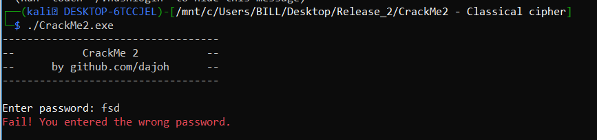

Phân tích chương trình bằng ida

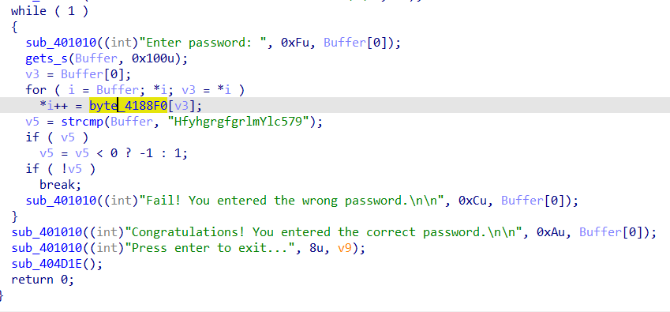

Chuỗi sau khi nhập vào sẽ được duyệt qua 1 lần và thay thế bằng giá trị của byte_4188F0[v3] với v3 là giá trị của chuỗi, sau đó so sánh với `HfyhgrgfgrlmYlc579`. 

Xem xét chuỗi byte_4188F0

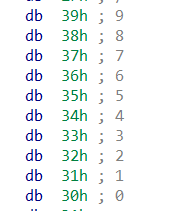

Sau khi xem xét thì ta nhận thấy chuỗi này chứa các giá trị hexa tương ứng với offset của nó, chỉ có chỗ là vị trí từ [0->9], [a->z], [A->Z] bị đảo ngược thứ tự so với ban đầu. Vì sự đối xứng này nên ta chỉ cần nhập chuỗi "HfyhgrgfgrlmYlc579" vào chương trình sẽ tìm ra flag(vì flag đối xứng "HfyhgrgfgrlmYlc579")

Đặt breakpoint và nhập `HfyhgrgfgrlmYlc579` vào chương trình

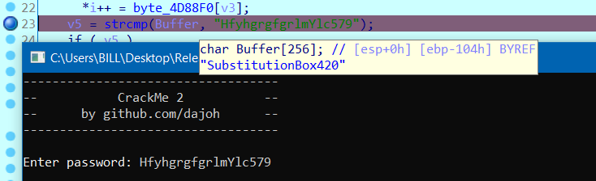

flag: `SubstitutionBox420`

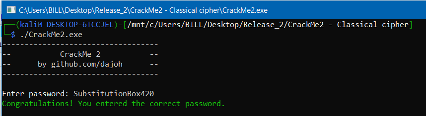

## EscapeTheDunge0n - Expl0it

Chạy thử chương trình, trông có vẻ khá phức tạp

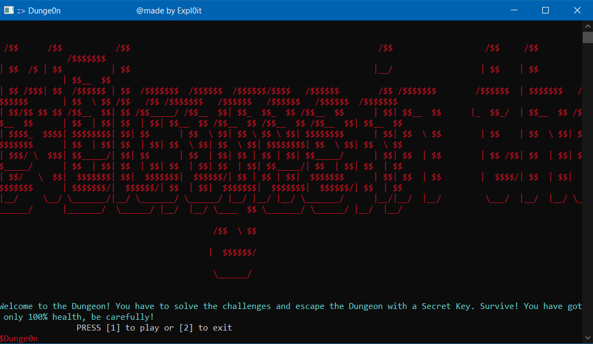

Phân tích chương trình bằng IDA

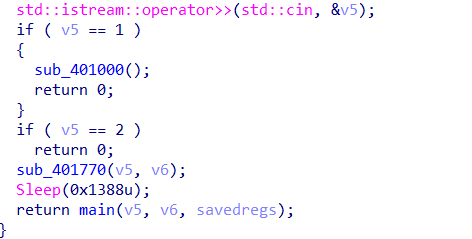

Ta thấy việc đầu tiên làm là phải nhập số 1 vào, vì nhập số 2 chương trình sẽ thoát, tiếp tục phân tích hàm sub_401000

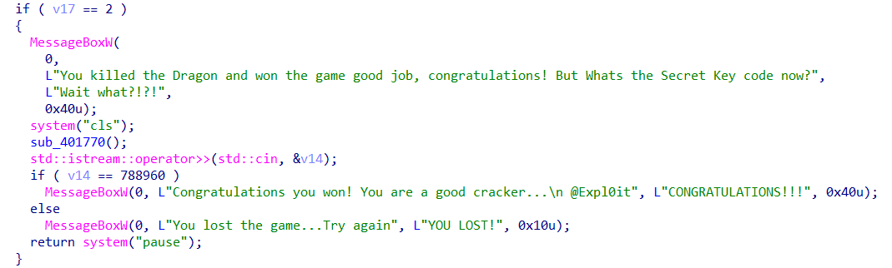

Hàm rất dài nhưng chúng ta thấy được đoạn mà chúng ta cần tới, để đi tới đây thì chúng ta cần lần lượt nhập 2 1 2 và cuối cùng là 788960 để so sánh (dựa theo code)

Vậy tổng cộng các bước là

`1 -> 2 -> 1 -> 2 -> 788960`

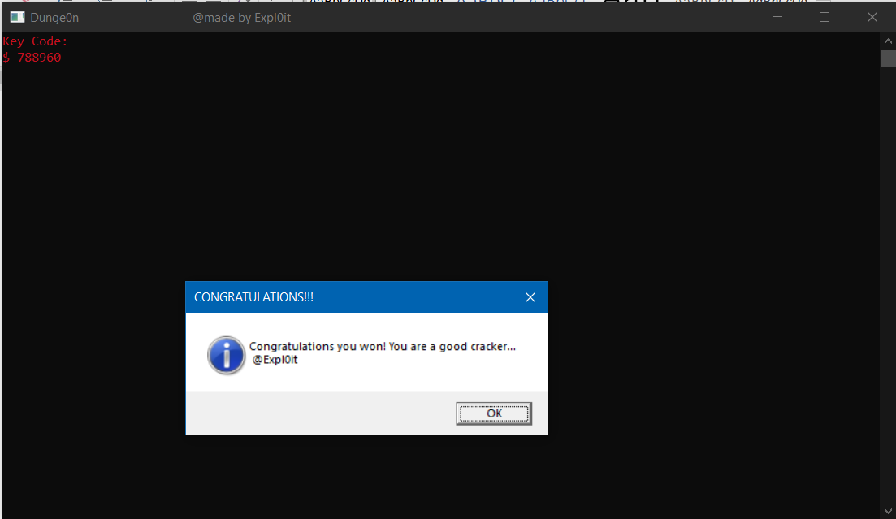

## Find password

Chạy thử chương trình, chương trình yêu cầu nhập pass

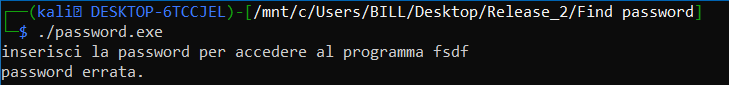

Phân tích với IDA

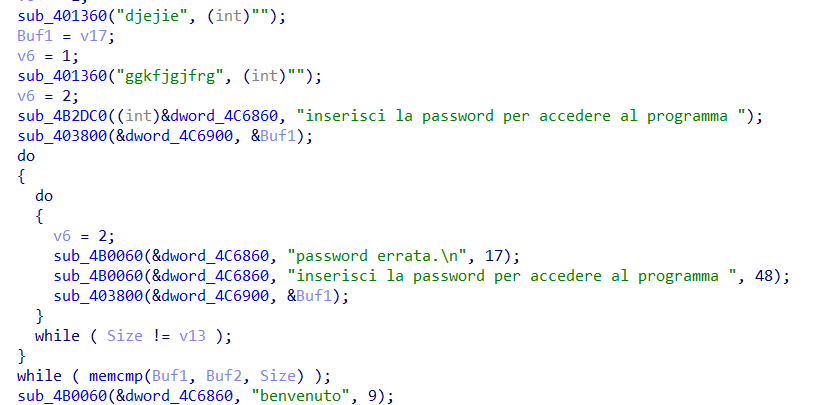

Để in ra chữ `benvenuto` thì ta cần chuỗi Buf1 và Buf2 bằng nhau và độ dài của size = v13, chuỗi Buf1 chính là chuỗi ta nhập vào. Đặt breakpoint để xem giá trị của chuỗi Buf2 và v13.

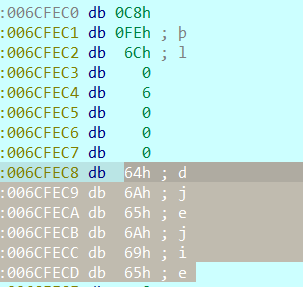

Ta thấy vị trí Buf2 chứa địa chỉ 0x6cfec8, tại đó chứa chuỗi `djejie`. Giá trị Size = độ dài chuỗi nhập vào và giá trị v13 = 6. Từ đó tìm được chuỗi cần nhập là `djejie` (lúc đó Buf1 = Buf2, Size = v13 = 6)

Cần phải nhập ở lần thứ 2 vì lần đầu nhập không có tác dụng

Flag: `djejie`

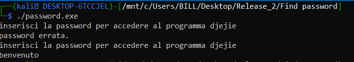

## FindMySecret

Chạy thử chương trình, yêu cầu nhập một số

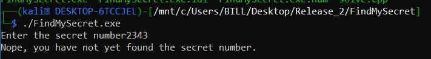

Phân tích bằng IDA

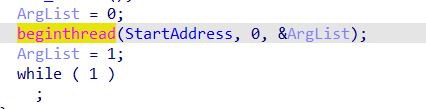

Chương trình này có một điểm đặc biệt đó là ta không thể đặc debug từ lúc chạy chương trình được, tại dòng lệnh beginthread, chương trình khởi tạo một luồng mới chạy để dò các breakpoint và làm một vài công việc khác

Đây là vị trí hàm luồng chạy

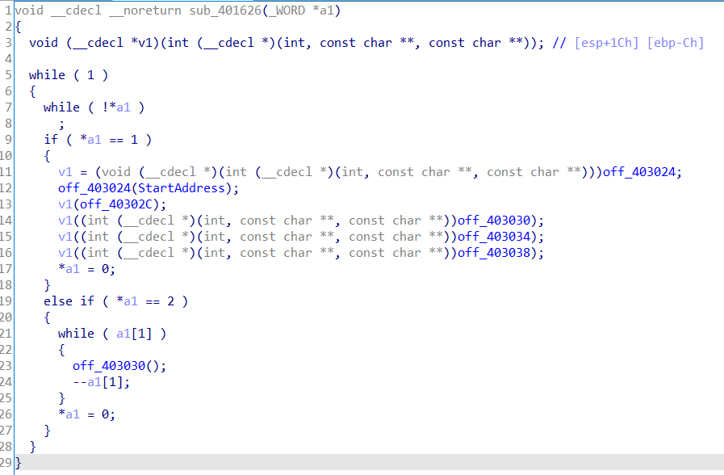

Luồng này chia làm 2 giai đoạn, giai đoạn 1 là quét breakpoint ở 5 hàm có địa chỉ được lưu tại các off_403024, off_403030, … Sau khi phân tích thì nó gồm hàm main, hàm sub_401626(luồng), hàm tính toán ở bước 2(off_403030) và 2 hàm được gọi ở hàm main.

Đây là hàm ở off_403024, khi gặp byte 0xCC(debug) sẽ thoát chương trình.

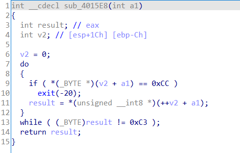

Sau đó qua giai đoạn 2, luồng sẽ gọi hàm tại offset off_403030 a1[1] lần.

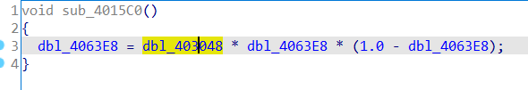

Hàm này sẽ được lặp lại a1[1] lần, với dbl_403048 = 3.8 (xem memory)

Quay trở lại hàm main

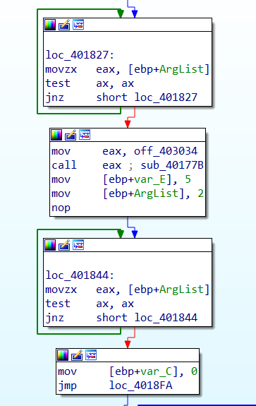

Ta có thể thấy rõ là hàm main sẽ đợi cho luồng thực thi giai đoạn 1 ít nhất 1 lần xong, rồi sẽ gọi hạm sub_40177B, rồi tiếp tục đợi luồng thực thi giai đoạn 2 ít nhất 1 lần, ta cũng thấy được giá trị a1[1] = 5 được gán sau giai đoạn 1. Tức hàm off_403030 sẽ được gọi chạy 5 lần

Hàm sub_40177B

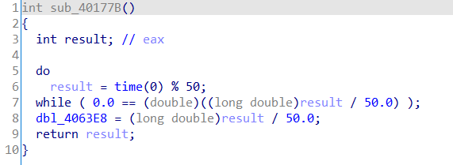

Hàm này sẽ tính toán gán dbl_4063E8 = (time(0) % 50) / 50 (khác 0)

Tiếp theo là 2 hàm gọi khi loop và so sánh kết quả

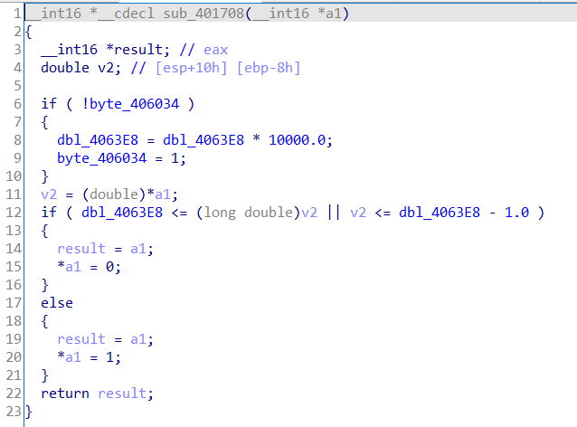

Hàm này gán a1 = 1 nếu dbl_4063E8 <= (long double)v2 || v2 <= dbl_4063E8 - 1.0, ngoài ra giá trị dbl_4063E8 *= 10000 duy nhất 1 lần trong suốt chương trình chạy.

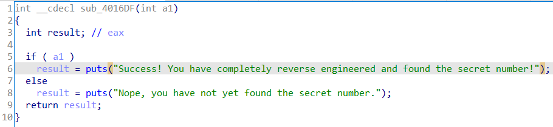

Cuối cùng là hàm so sánh để kiểm tra đúng sai của flag

Tóm gọn lại cách chương trình hoạt động như sau:

```bash
1. Chương trình gọi ra 1 luồng mới, luồng quét các breakpoint tại 5 hàm chính
2. Chương trình đợi luồng chạy xong phần 1 ít nhất 1 lần thì gọi hàm sub_40177B tính toán và gán dbl_4063E8 = (time(0) % 50) / 50
3. Luồng chạy phần 2 gọi hàm sub_4015C0 5 lần, mỗi lần gán
dbl_4063E8 = 3.8 * dbl_4063E8 * (1.0 - dbl_4063E8)
4. Chương trình đợi luồng chạy xong phần 2 thì tiến hành gọi nhập input là một số và lưu vào a1
5. Sau khi nhập xong thì gọi hàm sub_401708 (a1):
- Nếu là lần đầu thì gán dbl_4063E8 = dbl_4063E8 * 10000
- Gán a1 = 1 nếu a1 < dbl_4063E8 và dbl_4063E8 > dbl_4063E8 – 1
6. Nếu a1 thì check flag thành công
```
Vậy để giải chương trình này, flag sẽ phụ thuộc vào time(0) tức thời gian chúng ta gọi chương trình chạy, có tổng cộng 50 trường hợp và chương trình cho thử tối đa 6 trường hợp

Viết code c để tính 50 trường hợp rồi dựa vào [https://www.epochconverter.com/](https://www.epochconverter.com/) để chọn flag thích hợp

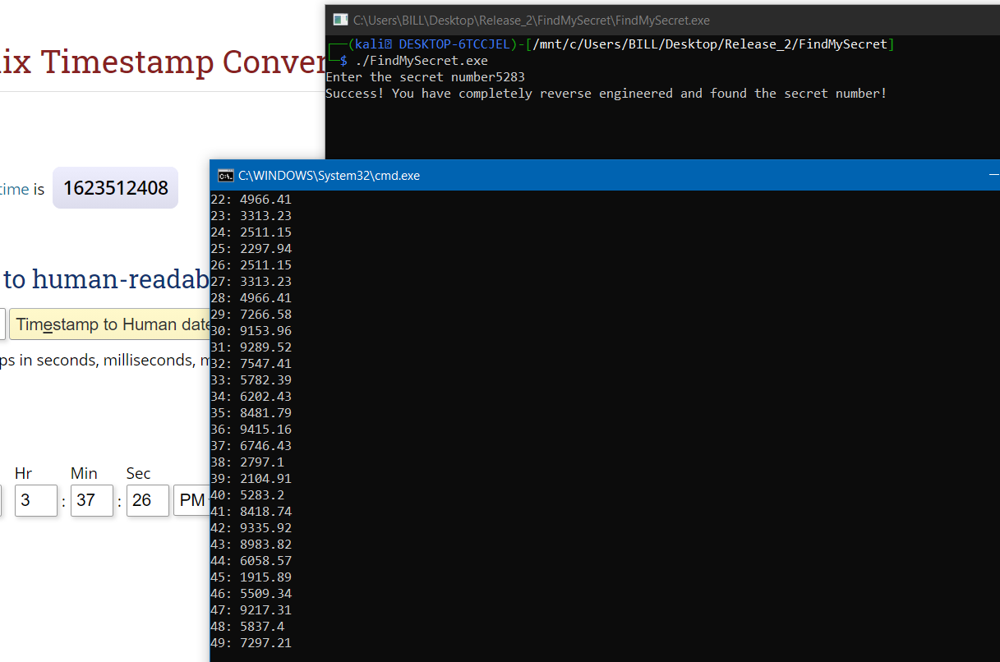

Lúc mình chạy chương trình là 1623512390, vì vậy mình nhập flag là 5283

File [solve.cpp](FindMySecret/solve.cpp) (tính toán flag)

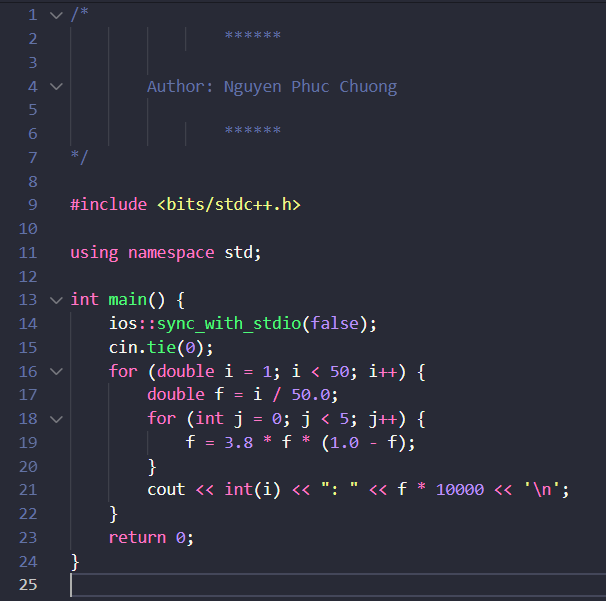

Hoặc cũng có thể dùng code python để giải, tuy nhiên đôi lúc sẽ có sự sai số về thời gian (chênh lệch 1s)

Code [solve.py](FindMySecret/solve.py)

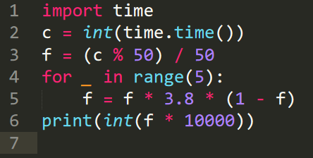

Kết quả

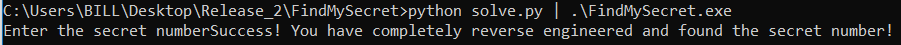

## Just crackme

Chạy thử, chương trình yêu cầu nhập flag

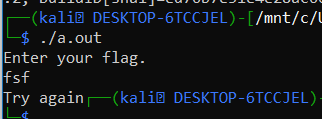

Phân tích bằng IDA

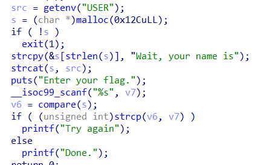

Đầu tiên tên user sẽ được lấy và gán vào biến src, sau đó được nối vào sao chuỗi s

Lúc này chuỗi s = `“Wait, your name is” + getenv(user)`

Sau đó chuỗi s này được đưa vào hàm compare và so sánh chúng với chuỗi nhập vào là v7.

Vì tên user dùng trong bài này là kali => s = `“Wait, your name iskali”`

Hàm compare

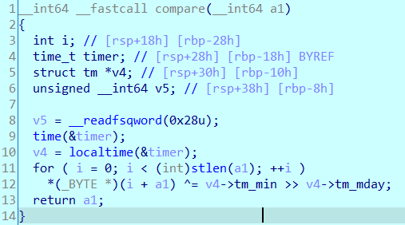

Các kí tự trong chuỗi s lần lượt xor với giá trị (v4->tm_min >> v4->tm_mday), là hai giá trị phụ thuộc vào thời gian chạy chương trình (hàm localtime). Chuỗi nhập vào cần giống với chuỗi s sau khi đã biến đổi. Ta có thể viết code python để tự động giải bài này

File [solve.py](Just%20crackme/solve.py)

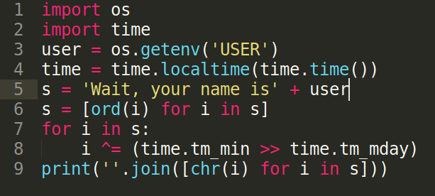

Kết quả:

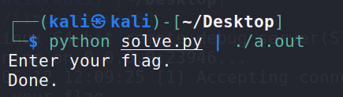

## Keygen Me Part 1

Chạy thử, chương trình yêu cầu nhập username và serial

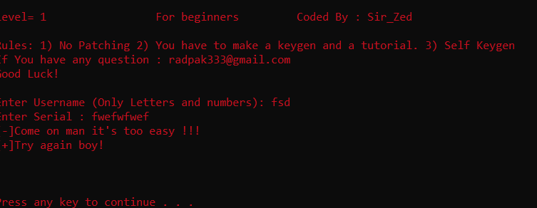

Dựa vào kinh nghiệm làm bài keygen lần trước, có vẻ như serial sẽ được tính toán dựa trên username nhập vào. Kiểm tra file với IDA

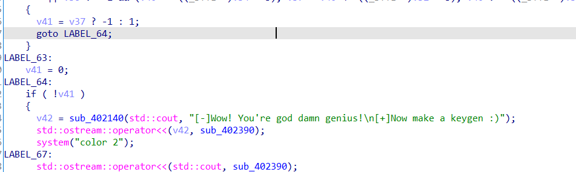

Ta tìm được đích cần đến là ơ vị trí này, điều kiện cần là v41 = 0, trong cả code chỉ có 1 vị trí gán v41 = 0 đó là LABEL_63, vì thế ta cần nhảy đến LABEL_63

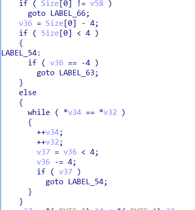

Từ đoạn code này cho thấy rằng ta có thể đến LABEL_63 theo 2 cách, cách 1 là Size[0] = 0, cách 2 là (Size[0] % 4 == 0) và sử dụng  (\*v34 == \*v32) đủ số lần để giảm v36 -= 4.

Ta để ý đoạn code này

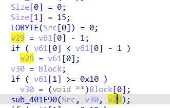

Và trong hàm sub_401E90

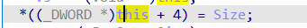

Phía trên đó ta thấy được hàm sub_401E90 gọi với 3 tham số Src, v30, v29. Trong đó phần code của hàm sub_401E90, \*(Src + 4) = v29, (\*Src + 4) chính là vị trí của Size[0]. Từ đó suy ra Size[0] = v29 = (v61[0] – 1 hoặc v61[0] nếu v61[0] == 0)

Vậy chúng ta lại có 2 con đường, 1 là v61[0] == 0 hoặc (v[61] – 1) % 4 == 0

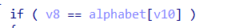

Trong có vẻ đơn giản vì ban đầu v61[0] được gán = 0, và chỉ cần không match điều kiện if phía trên thì v61[0] = 0, tuy nhiên

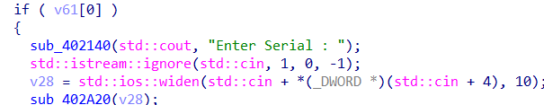

Ở đây lại có yêu cầu v61[0] != 0, vậy loại hướng v61[0] == 0

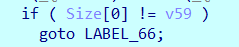

Thêm một điều kiện cần là Size[0] == v59

Sau khi đọc code và debug trong hàm nhập serial

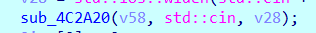

Ta nhận thấy được là biến v59 sẽ được gán bằng giá trị của độ dài chuỗi serial nhập vào

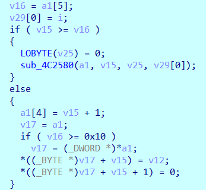

Biến a1[4] chính là v59, nếu như độ dài serial chưa quá 0xF thì v59 = độ dài serial

Vậy chúng ta chỉ còn 1 cách đó đó là gán v61[0] = độ dài serial + 1. Sao cho (v61[0] – 1) % 4 == 0 và số lượng match của vòng (*v34 == *v32) đủ để đưa v36 về = 0

Tiếp theo là phần khó nhất và mệt nhất là làm sao để tính được v61 từ chuỗi đầu vào

Mình cũng không rõ cách tính như nào, nhưng mình thử debug với một vài kí tự a, b, c, d. Mình nhận ra rằng chuỗi

`b===================================`

sẽ tạo ra giá trị v61[0] = 5. (‘b’ hoặc “B” đứng ở vị trí đầu cộng cho v61[0] = 5)

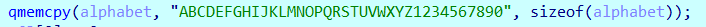

vòng lặp do while thứ 2 ở đầu hàm sẽ luôn chạy cho dù không nhập đủ 36 kí tự, vì thế ta cần nhập 35 kí tự “=” để v61[0] không bị thay đổi (không match với alphabet)

Tiếp theo mình cần nhập serial có độ dài là 4 và hàm *v34 == *v32 match ít nhất 1 lần. 

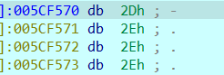

Với input của mình nhập thì *v34 được tạo như hình trên, còn *v32 chính là serial chúng ta nhập

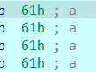

Vì vậy thử với username và serial như sau
```
Username = “b===================================”
Serial = “-...”
```

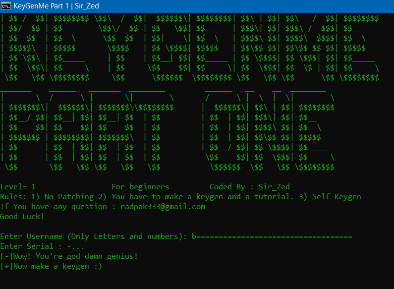

## no strings attached

Chạy thử chương trình, yêu cầu nhập flag

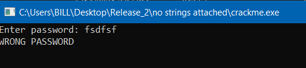

Phân tích với IDA

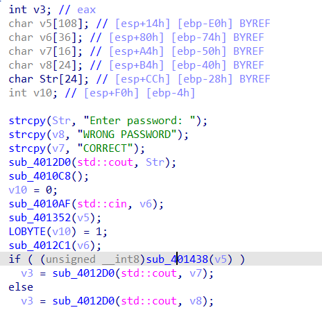

Nhìn vào code, ta có thể thấy hàm sub_401438(v5) cần trả về giá trị khác 0

Hàm sub_401438 lại gọi đến hàm sub_4063D0

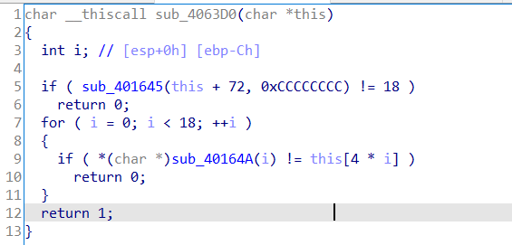

Trong đó hàm sub_401645(this+72) sẽ trả về độ dài của chuỗi v6 (địa chỉ this+72), sau đó lặp lại qua 18 kí tự và so sánh với kí tự tại v5[i * 4]

Như vậy đặt debug và xem giá trị tại vị trí v5

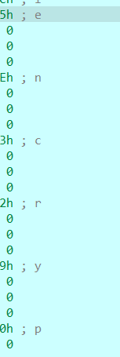

Mỗi kí tự cách nhau 4 đơn vị, ta có flag là:

`encrypted-c-string`

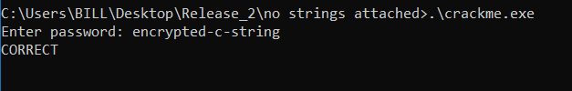

## racecars

Chạy thử chương trình


Phân tích với IDA


Ta thấy chương trình sẽ lấy chuỗi argv và duyệt, chuỗi argv chính là phần tên chúng ta chạy chương trình. Lấy từ cuối chuỗi đến kí tự ‘/’ đầu tiên và duyệt nó phải giống nhau.

Đây là chuỗi argv nếu ta chạy file racecars


Chương trình sẽ lấy phần tên là ‘racecars’ và tiến hành kiểm tra ở dưới.

Vậy tức là phần tên của ứng dụng phải giống nhau từ đầu đến cuối, ta thử đổi tên ứng dụng thành c. ví dụ


Flag là đổi tên ứng dụng

## WarGames

Chạy thử file


Phân tích với IDA


Nhìn qua ta thấy rằng chuỗi password nhập vào cần có độ dài là 9, và cần bằng với các giá trị mà v6[i] – (rand() % 5 + 1) tạo ra, tuy nhiên vì phía trên chương trình có lệnh srandom(1983), vì vậy nên các giá trị rand() tạo ra ở mỗi lần chạy là hoàn toàn như nhau, từ đó ta có thể debug để xem các giá trị của v6[i], lặp lại 9 lần để tìm chuỗi hoàn chỉnh


Vậy password là `dont play`


## ZED-Crackme

Kiểm tra chương trình với lệnh file


Ta thấy chương trình báo no section header, từ đây ta đoán rằng có lẽ chương trình đã bị packed

Chạy thử lệnh strings, ta có được info như sau


Vậy chương trình đã dùng upx để packed, chúng ta có thể sử dụng upx -d để unpack


Mở file sau khi unpack với ida


Ta thấy chuỗi nhập vào là s2, sau đó so sánh với s1, chuỗi s1 được tạo từ chuỗi v6 = `Ahi23DEADBEEFCOFFEE`

Các công thức cũng khá đơn giản để tính toán, ta viết code python tìm s1 theo chương trình 

file [solve.py](ZED-Crackme/solve.py)


Tìm flag


Flag: `C(uiICD@CADDEBNEEDD`


